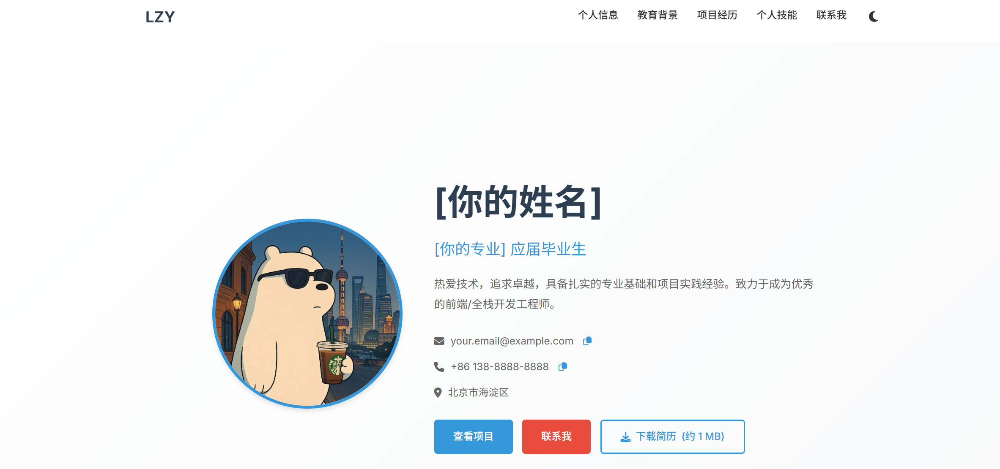

 
📋 点击展开完整 README.md 内容（推荐复制这个）

# 🎯 个人简历网站

一个现代化、响应式的个人简历网站，专为应届毕业生设计。

## 🌐 在线访问
- **网站地址**: [https://LLL3-L.github.io/code/](https://LLL3-L.github.io/code/)
- **GitHub仓库**: [https://github.com/LLL3-L/code](https://github.com/LLL3-L/code)

## ✨ 功能特性
- ✅ 响应式设计（手机/平板/电脑）
- ✅ 深色/浅色主题切换
- ✅ 一键复制联系方式
- ✅ PDF简历下载
- ✅ 技能进度条动画
- ✅ 项目展示

## 🛠️ 技术栈
| 技术 | 用途 |
|------|------|
| HTML5 | 页面结构 |
| CSS3 | 样式设计 |
| JavaScript | 交互功能 |
| GitHub Pages | 免费托管 |

## 📁 项目结构
my-resume/
├── index.html # 主页面
├── style.css # 样式文件
├── script.js # 交互脚本
├── assets/ # 静态资源
│ ├── images/ # 图片
│ └── resume.pdf # PDF简历
└── README.md # 项目说明
## 🚀 快速开始
### 本地运行
1. 下载项目
2. 用浏览器打开 `index.html`

### 在线编辑
1. 访问 GitHub 仓库
2. 点击文件旁的编辑图标修改

## 🔧 自定义内容
编辑 `index.html` 文件：
1. **个人信息**（姓名、联系方式）
2. **教育背景**（学校、专业）
3. **项目经历**（项目描述、技术栈）
4. **技能列表**（技能名称、掌握程度）

## 📱 响应式设计
- **手机端**：单列布局，汉堡菜单
- **平板端**：两列布局
- **桌面端**：完整布局

## 🚀 部署
使用 GitHub Pages 免费部署：
1. 推送到 GitHub
2. 开启 GitHub Pages
3. 自动生成网站

## 📞 联系方式
- **姓名**: LZY
- **邮箱**: .qq.com
- **GitHub**: [@LLL3-l](https://github.com/LLL3-l)

---

⭐️ **如果觉得有用，请给个 Star！** ⭐️
## 📸 网站截图

### 桌面端

<!--### 移动端
-->

